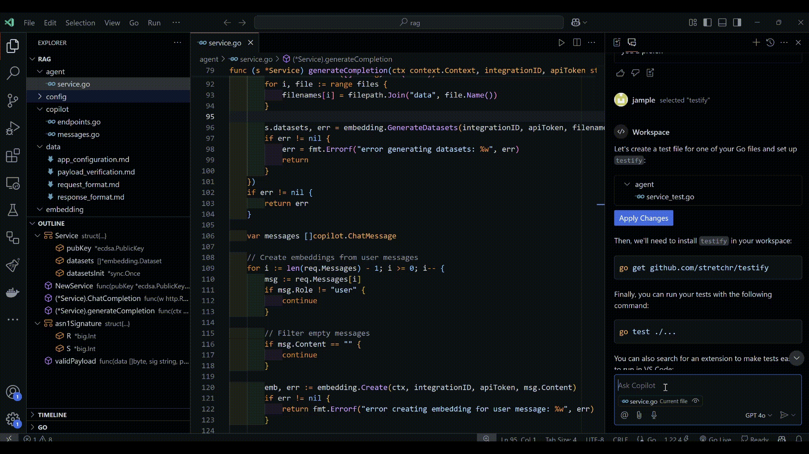
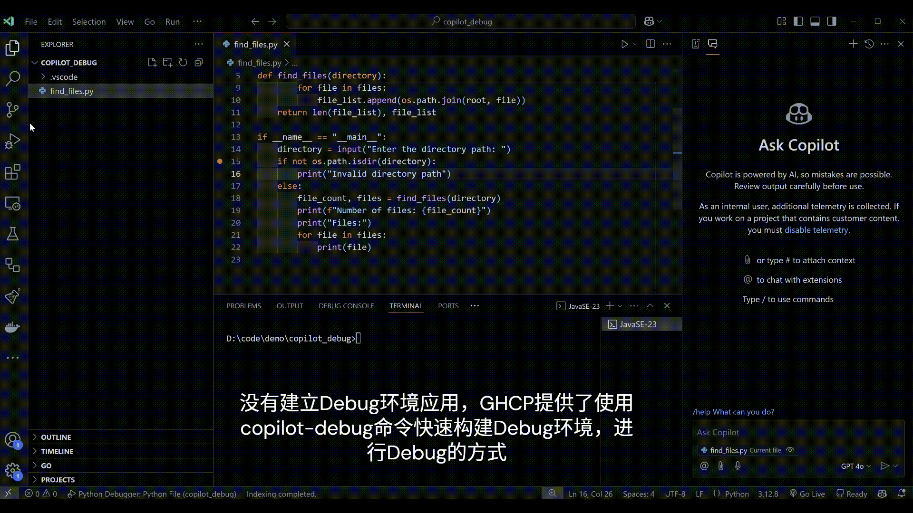
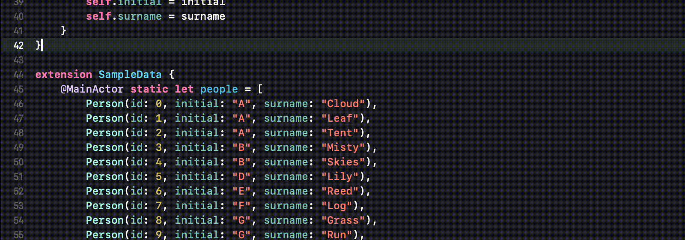
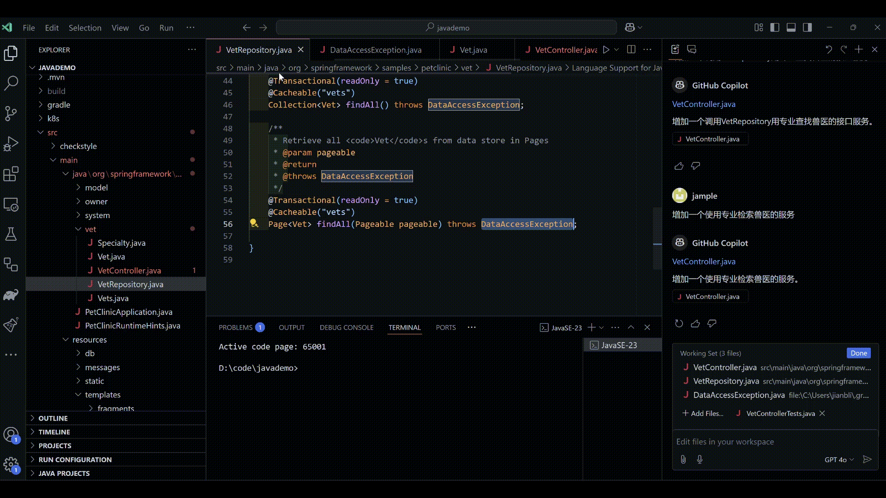
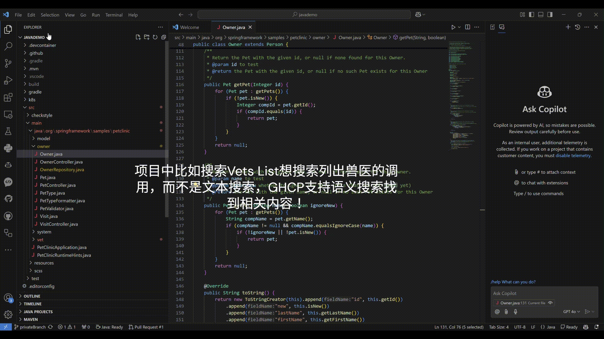
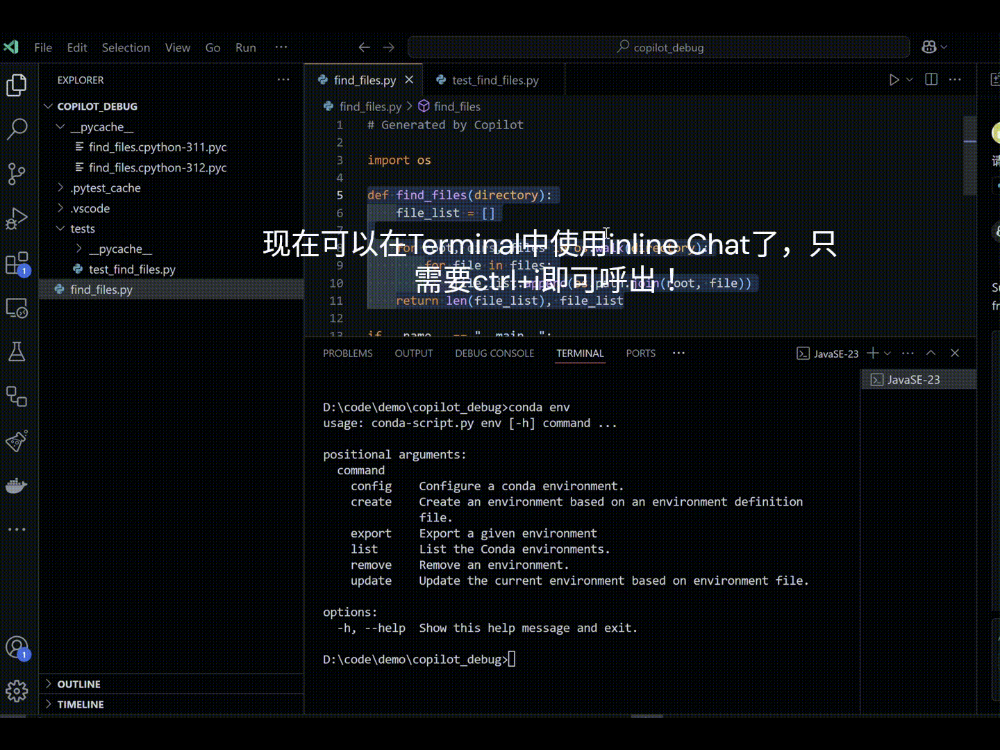

# GHCP_Demo
这个内容用为为GitHub Copilot的用户学习使用GHCP提供服务！

目前整理了截至 2025.1月的重要Github Copilot新特性功能，请每个内容点入详细观看：

## 1. 多文本编辑 - [Multi Files Edit](./mutlEdit/README.MD)

## 2. GHCP的智能代码评审 - [GHCP Code Review](./codereview/README.MD)

## 3. GHCP的Workspace Agent和Github Agent - [GHCP Workspace Agent](./ws_gh_agents/README.MD)

## 4. GHCP的测试功能 - [GHCP Test](./genTests/README.MD)

## 5. GHCP的自定义提示词 - [GHCP Custom Words](./customPrompt/README.MD)

## 6. GHCP的模型市场 - [GHCP Workspace](./modeMarket/README.MD)

## 7. GHCP的工作空间 - [GHCP Workspace](./ghcpWS/README.MD)

## 8. Java项目升级 - [Java Upgrade Assistance](./javaUpgradeAssistance/README.MD)

## 9. GHCP的调试功能 - [GHCP Debug](./copilotdebug/README.MD)

## 10. GHCP的XCode集成 - [GHCP XCode](./xcode/README.MD)

## 11. GHCP的符号表集成 - [GHCP Symbol Table](./symbol/README.MD)

## 12. GHCP的语义搜索 - [GHCP Semantic Search](./symsearch/README.MD)

## 13. GHCP的终端嵌入式对话 - [GHCP Terminal Chat](./terminalInline/README.MD)

