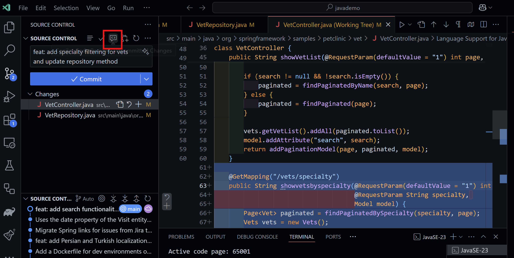

这是一个关于Github Copilot Code Review功能的使用介绍

GHCP的Code Review是一个大家关注的重要使用功能，在2024的Github Universe上已经正式发布，但是目前还在申请测试阶段，所以使用此功能请注意您是否已经有了相关的权限。

GHCP的Code Review包括三种方式：

### 1. 本地Code Review模式：即在用户本地VS Code工作空间，结合Commit对话，对本地文件的修改通过GHCP进行自动化Code Review，从而在提交前发现代码问题。
       
       下面是一个使用GHCP的Code Review功能的例子: 展示了针对一个Java项目的本地修改，自动生成Comments，并进行Code Review的过程。

### 2. 云端Code Review模式：即用户在Github端，使用GHCP结合最新的Commit进行代码评审，发现可能的问题。
       
       下面是一个使用GHCP的云端Code Review功能的例子: 展示了针对一个Java项目提交到云端的修改，利用GHCP手工进行Code Review的过程。

