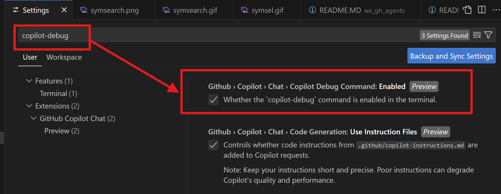

这是一个关于Github Copilot Setup Debug功能的使用介绍

对于不熟悉的语言环境和项目，创建Debug配置和环境十分繁琐，GHCP提供快速帮助用户创建Debug配置和环境的方式。用户可以在GHCP的Chat中使用@vscode /startDebugging方式快速创建；也可以使用copilot-debug命令创建，从而满足使用的需要。

GHCP的创建Debug配置和环境的两种方式例子，配置的是Python调试环境，其他语言也类似：

### 1. 使用GHCP的Chat中使用@vscode /startDebugging方式快速创建Debug配置：
       

### 2. 使用copilot-debug命令创建Debug配置：
       
       在使用copilot-debug命令前，需要打开copilot-debug命令开关:在VS Code的设置中搜索copilot-debug，打开开关即可使用,具体如下图。

       

       使用copilot-debug开关打开后，具体使用copilot-debug过程如下：

