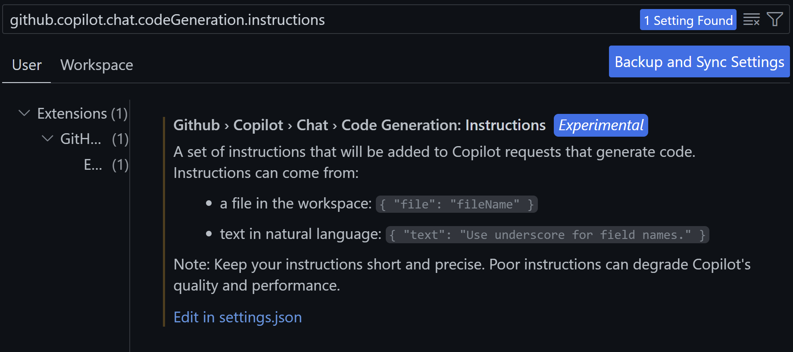

这是一个关于Github Copilot Custom Prompt功能的使用介绍

GHCP拥有强大的代码生成功能，但是实际使用中，需要结合用户的使用环境和规则进行相关设置，从而让生成的代码遵循用户的规范和要求，这就是GHCP的Custom Prompt功能。

Custom Prompt功能设置有两种方式：

### 1. VS Code设定模式：即根据用户的需要在VS Code的设置中进行相关的设置，从而让GHCP生成的代码符合用户的规范。

       A. 使用VS Code的Setting设置找到github.copilot.chat.codeGeneration.instructions配置项，如下图所示：

       B. 打开相关的VS Code配置json，配置对应text和file选项：

[codereview](./resources/setting_json.png)

       C. 对于specification.md文件也进行配置：

[codereview](./resources/specification.png)

### 2. 本地Workspace设定模式：用户可以在各自的.github/copilot-instructions.md进行设置，GHCP自己会去寻找此内容，实现对GHCP生成代码进行规范：

       A. 使用VS Code的Setting设置找到github.copilot.chat.codeGeneration.useInstructionFiles配置项并打开，如下图所示：

[codereview](./resources/instructionsetting.png)

       B. 配置.github/copilot-instructions.md,实现相关规范，如下图所示：

[codereview](./resources/instruction.png)

下面是一个GHCP Custom Prompt的例子，实现了完整过程的定义，并融合了上面两种设定方式，GHCP自动进行了规则合并，实现了规范GHCP代码生成的要求。

