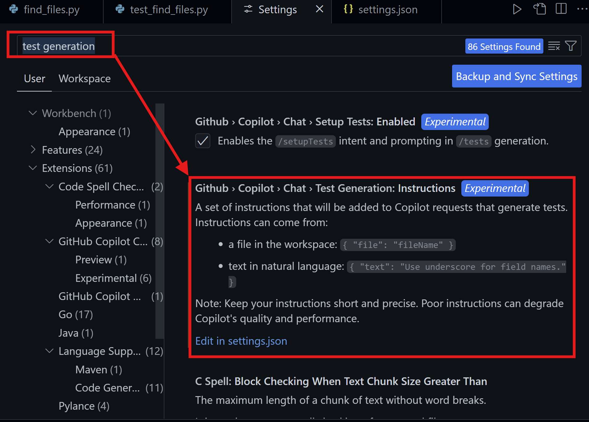

这是一个关于Github Copilot Setup Tests已经Generate Tests功能的使用介绍

测试是软件开发过程中的重要环境，可以使用GHCP方便的进行测试配置设置和测试生成，并引导HCP的AI实现更好的测试生成，提高覆盖率和准确性。

下面是针对Python语言通过GHCP的测试配置和测试生成的过程，其他语言也类似：

### 1. 使用GHCP的Chat中使用@vscode /setupTests方式快速创建测试配置：

       A.要使用setupTests功能，需要在VS Code配置中，搜索setup test，
       打开Github › Copilot › Chat › Setup Tests: Enabled开关，具体如下图：

       打开setupTest开关后，具体使用setupTest过程如下：

### 2. 使用GHCP的Chat中使用@vscode /tests方式生成测试，并结合测试框架修改和执行测试：
       

       针对有经验的测试人员，也可以自己定义测试生成内容，配置过程如下：

       A.在VS Code配置中，搜索test generation，打开settings.json文件:

       B.通过text或者file进行测试生成内容以及执行规范的定义，具体如下：:

