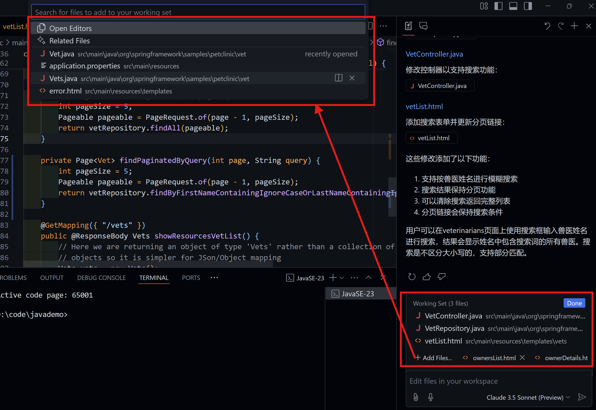
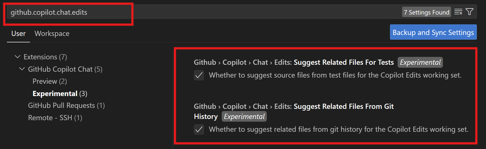

这是一个关于Github Copilot Multi Edit功能的使用介绍

GHCP的Mulit Files Edit是一个大家关注的重要使用功能，在2024的Github Universe上已经正式发布，在Github Copilot 1.95版本实现了多个文件的联合编辑，为AI智能开发解决复杂问题提供了更好的功能实现。
具体使用的方式是在在GHCP的Edit的WorkSet中手工添加文件或者通过GHCP借助提示词自动识别相关文件形成文件集，GHCP会自动对对此文件集进行编辑处理，实现开发者的需求。

下面是一个使用GHCP的Multi Files Edit功能的例子: 基于Spring示例项目PetClinic, 在一系列提示词的引导下，实现了对于兽医查询功能的快速实现，本例子使用的是GHCP的智能Multi Edit功能，自动实现了对于WorkSet中关联文件的识别和相关内容的编写，主要包括以下内容：

### 1. 导入PetClinic项目，并展示其采用了Spring Framework的Controller和Repository以及对应VO的实现，并映射到H2数据库中。

### 2. 通过GHCP的提示词，实现了对于兽医查询功能的快速实现，GHCP自动识别了WorkSet应该修改的文件内容，并基于前后逻辑进行内容修改，实现此需求。

### 3. 使用Gradle bootRun，编译执行修改后的PetClinic应用，开到了兽医查询界面，并进行相关逻辑验证，满足了使用的需求。

Multi Files Edit在自动进行文件关联,目前在试验阶段有两个开关如下：

### 1. `Suggest Related Files for Tests` : 是进行测试相关文件的推荐关联。

### 2. `Suggest Related Files from Git` :  是进行Git仓库内容文件的推荐关联。

