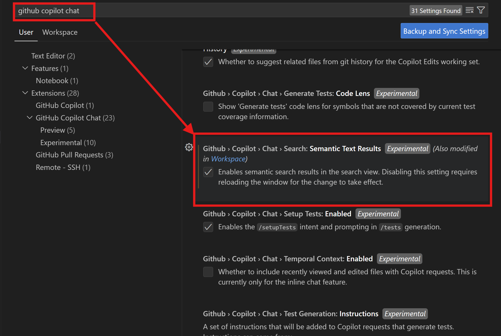

这是一个关于Github Copilot Semantic Search（语义搜索）功能的使用介绍

我们在进行开发过程中，有时候需要进行相关信息搜索，并不是进行文本意义的搜索，而是语义的搜索，比如搜索调用了vet list（兽医列表）的函数和类，这时候可以使用GHCP的Symanctic Search来实现语义搜索。

### 使用GHCP语义搜索，需要打开Github Copilot:Chat:Search:Semantic Text Results功能：

### 下面一个例子是进行GHCP Symantic Search的情况：

