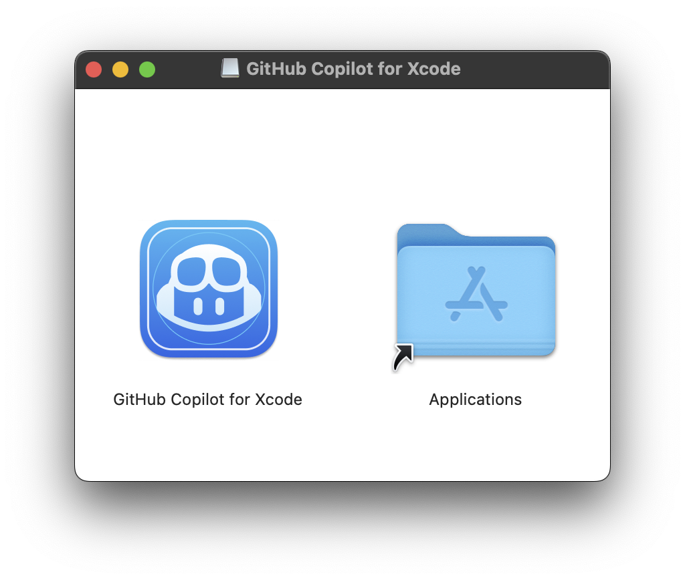
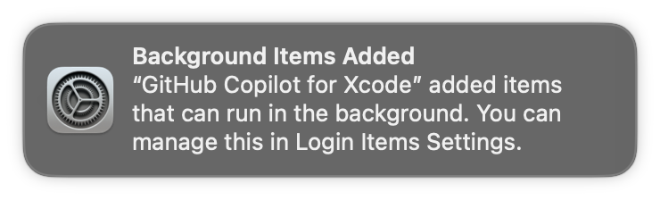
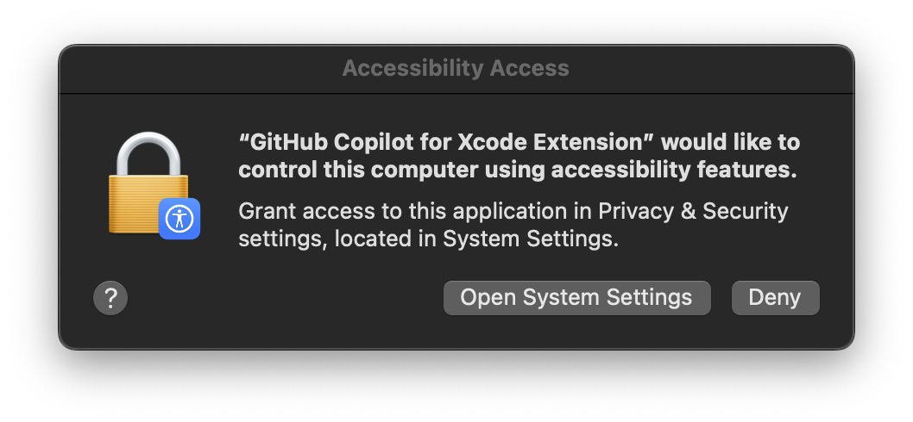
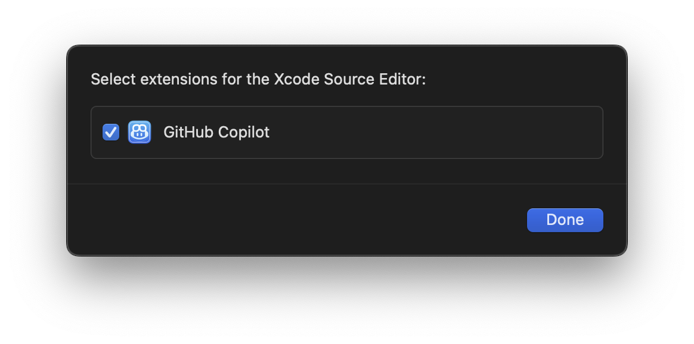
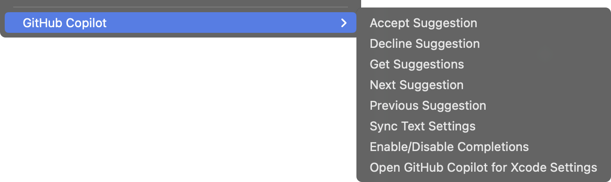
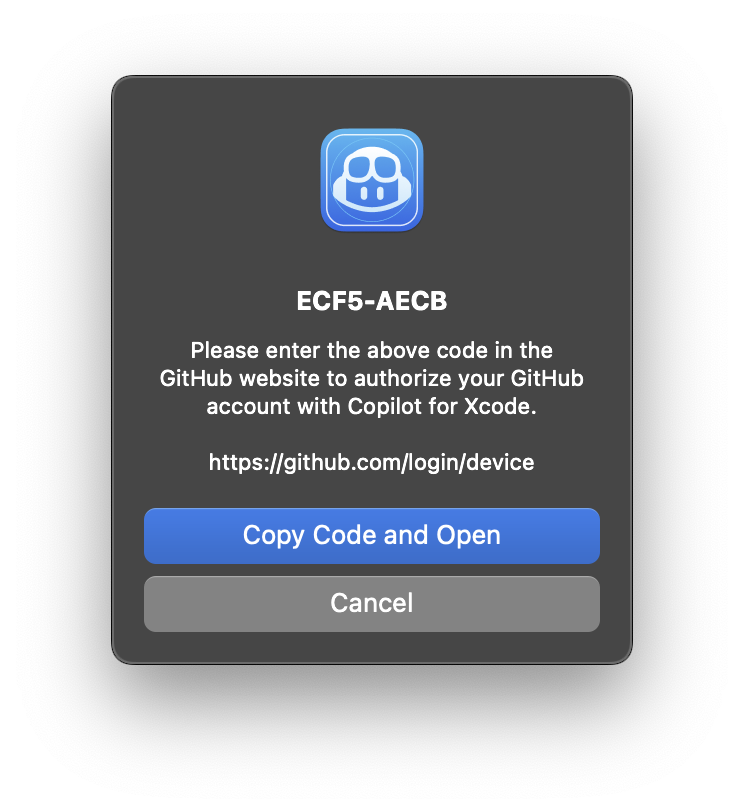
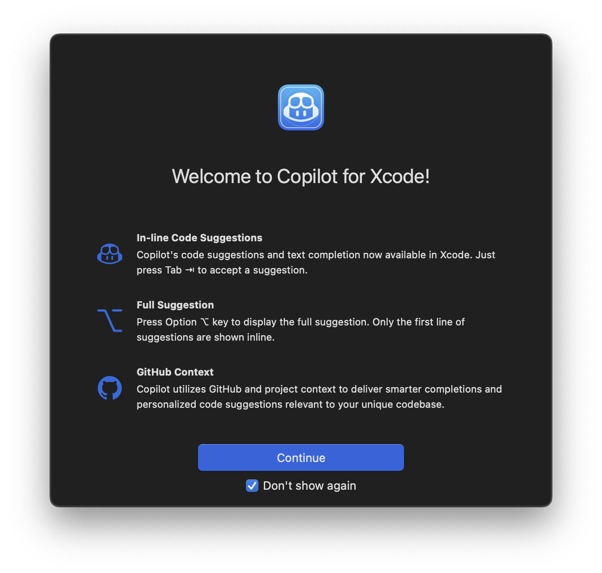

这是一个关于Github Copilot XCode功能的使用介绍

针对Apple生态系统的开发者，XCode是一个非常重要的开发工具，最新版本的GHCP提供了XCode的AI辅助功能，可以帮助开发者更好的进行iOS、MacOS、WatchOS、TVOS等Apple平台的应用开发。

### 下面展示了在XCode中进行基于GHCP辅助的代码开发过程。


### 如何希望使用此功能，可以按照如下方式，完成GHCP的XCode插件安装。

### 1.系统需求

- macOS 12+
- Xcode 8+
- A GitHub Copilot 订阅.

### 2.安装过程

1. 通过homebrew安装 [Homebrew](https://brew.sh/):

   ```sh
   brew install --cask github-copilot-for-xcode
   ```

   或者下载 `dmg` ，下载地址
   [the latest release](https://github.com/github/CopilotForXcode/releases/latest/download/GitHubCopilotForXcode.dmg).
   下载后，拖拽 `GitHub Copilot for Xcode` 到 `Applications` 目录:

   <p align="center">
     
   </p>

   首次安装以后，升级内容的下载和安装都由XCode自动完成.

2. 一个提示已经启动了Copilot的图标，将出现在XCode打开时.
 
   <p align="center">
     
   </p>

3. `Accessibility` 和 `Xcode Source Editor Extension` 的权限需要打开.
   
第一次运行时候，提示打开 `Accessibility` 权限的提示如下：

   <p align="center">
     
   </p>

`Xcode Source Editor Extension` 的权限需要手工打开：在`Copilot for Xcode`中点击 `Extension Permission` ，打开“系统配置-System Preference”的`Extensions`面板，选择`Xcode Source Editor`并启用`GitHub Copilot`:

   <p align="center">
     
   </p>

4. 请注意，打开权限后，需要重启Xcode，确保`Github Copilot`菜单在Xcode `Editor`菜单下可用且未禁用：
    
   <p align="center">
      
   </p>

在`Key Bindings`中可以为所有菜单项设置快捷键。

5. 点击`Sign in`登录进入GitHub Copilot，这将打开一个浏览器窗口并复制一个代码到剪贴板，将代码粘贴到GitHub登录页面并授权应用。

   <p align="center">
     
   </p>

6. 当需要升级时候，点击菜单项`Check for Updates`，或者在设置应用中进行升级。
   
   安装新版本后，需要重启Xcode才能正确使用新版本.

   新版本也还是可以通过从发布页面下载`dmg`文件进行安装。第一次安装`dmg`版本，需要手工运行应用程序，接受来自互联网的下载警告。

7. 为了防止混淆，建议在`Xcode` > `Preferences` > `Text Editing` > `Editing`下禁用`Predictive code completion`。

8. 按`tab`接受建议的第一行，按住`option`查看完整建议，按`option` + `tab`接受完整建议。

   <p align="center">
     
   </p>
